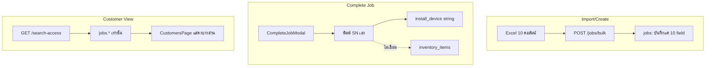
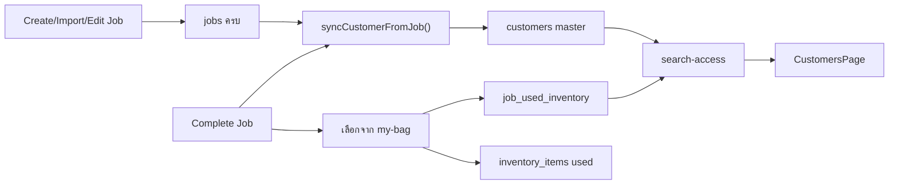

# แผน: จัดเก็บข้อมูลลูกค้าครบ + จบงานจากกระเป๋าช่าง (SN)

## สถานะปัจจุบัน (ปัญหา)



- Excel import บันทึกแค่ 10 ฟิลด์ ทั้งที่ [`jobs`](database/bou_schema.sql) มี ~50 คอลัมน์ ([`dispatch.js` bulk](backend/routes/dispatch.js) L341-351)
- ไม่มีตาราง `customers` สำหรับงานติดตั้ง (มีแค่ `ma_customers` สำหรับ MA)
- [`CompleteJobModal`](frontend/src/components/JobActionModals.jsx) ใช้ text input สำหรับ SN ทั้งหมด — ไม่ดึงจาก [`GET /inventory/my-bag`](backend/routes/inventory.js)
- การตัดสต็อกตอนจบงานถูก revert แล้ว (commit `39ef705`)

---

## เป้าหมาย

1. **Dispatch** — บันทึกข้อมูลงานครบใน `jobs` + sync ไป `customers` master ทุกครั้งที่สร้าง/แก้ไข/จบงาน
2. **Complete** — เลือกอุปกรณ์ SN 6 ช่องจากกระเป๋าช่างเท่านั้น (SOA, ONU, Playbox, Mesh, SIM, IP Camera); Splitt/Port/ระยะสาย/L3/3BB/SC ยังกรอกเอง
3. **Customer** — หน้าข้อมูลลูกค้าแสดงข้อมูลครบจาก master + รายการอุปกรณ์ที่ใช้จริง (SN + ชื่อสินค้า/รุ่น)



---

## Phase 1: Database Schema

เพิ่ม migration ใน [`backend/routes/migrate.js`](backend/routes/migrate.js) (หรือ SQL script ใหม่):

**ตาราง `customers`** (office install, key = `access_no`):
- ข้อมูลลูกค้า: `customer_name`, `phone`, `address`, `province`, `area_code`, `area_name`, `lat`, `lng`, `map_link`
- ข้อมูลงาน/ISP: `package`, `product`, `order_no`, `customer_order_no`, `task_type`, `task_order`, `product_owner`, `order_type`, `service_note`, `sla_status`, `region`
- สถานะล่าสุด: `latest_job_id`, `latest_job_status`, `install_device` (TEXT), `last_completed_at`, `completed_by`
- `created_at`, `updated_at`

**ตาราง `job_used_inventory`** (อุปกรณ์ที่ใช้ติดตั้งจริง):
- `job_id`, `inventory_item_id`, `device_role` (ENUM: `SOA|ONU|PB|Mesh|SIM|Cam`)
- denormalized: `sn`, `product_name`, `model_name`, `quantity`
- `used_at`, `used_by` (tech id)

**แก้ schema ที่ขัดกับโค้ดปัจจุบัน:**
- `inventory_items.status` — เพิ่มค่า `'used'`
- `inventory_logs.action` — เพิ่ม `'used'` + คอลัมน์ `note TEXT`
- `jobs.install_device` — ยืนยันเป็น TEXT (มีใน migrate แล้ว)

---

## Phase 2: Backend — Customer Sync

สร้าง helper `syncCustomerFromJob(conn, jobId)` ใน [`backend/routes/dispatch.js`](backend/routes/dispatch.js) หรือ `backend/utils/customerSync.js`:

- อ่าน row จาก `jobs` (join team/engineer ถ้าต้องการ)
- `INSERT ... ON DUPLICATE KEY UPDATE` ลง `customers` โดยใช้ `access_no` เป็น unique key
- เรียก sync จาก:
  - `POST /jobs` (สร้างงาน)
  - `POST /jobs/bulk` (นำเข้า Excel)
  - `PUT /jobs/:id` (แก้ไข)
  - `PUT /jobs/:id/complete` (จบงาน — อัปเดต `install_device`, `last_completed_at`, `completed_by`)

---

## Phase 3: Backend — ขยาย Bulk Import

**[`ImportExcelModal.jsx`](frontend/src/components/ImportExcelModal.jsx):**
- ขยาย template จาก 10 → ~20 คอลัมน์ สอดคล้องกับฟิลด์สำคัญใน `jobs`:
  - เดิม: Access No, Customer, Phone, Plan Date, Address, Lat, Lng, Package, Product, Remark
  - เพิ่ม: Order No, Customer Order No, Province, Area Code, Area Name, Task Type, Task Order, Product Owner, Plan Time, Service Note
- ปรับ header matching (keyword) ให้รองรับทั้งไทย/อังกฤษ

**[`POST /jobs/bulk`](backend/routes/dispatch.js):**
- รับฟิลด์ใหม่ทั้งหมดและ INSERT ลง `jobs`
- เรียก `syncCustomerFromJob` หลัง insert แต่ละแถว

**[`JobDispatchModal.jsx`](frontend/src/components/JobDispatchModal.jsx):**
- เพิ่มฟิลด์ที่ยังขาด (province, task_type, customer_order_no ฯลฯ) ให้สอดคล้องกับ backend `POST /jobs`

---

## Phase 4: Backend — จบงาน + ตัดสต็อกจากกระเป๋า

**`PUT /jobs/:id/complete`** รับ payload ใหม่:

```json
{
  "used_inventory": [
    { "inventory_item_id": 12, "device_role": "ONU" },
    { "inventory_item_id": 34, "device_role": "PB" }
  ],
  "installDevice": "SOA:... | ONU:... | ...",
  "...existing fields..."
}
```

Logic ใน transaction เดิม:
1. ตรวจว่าแต่ละ `inventory_item_id` เป็นของ `techId`, `status='dispatched'`, ไม่ซ้ำกัน
2. สำหรับ SN item (`quantity <= 1`): `UPDATE status='used', quantity=0`
3. `INSERT inventory_logs (action='used', quantity=1, note='ติดตั้งให้ลูกค้า: {access_no}')`
4. `INSERT job_used_inventory` พร้อม denormalize `sn`, `product_name`, `model_name`
5. สร้าง `install_device` string จาก role + SN (คงรูปแบบเดิมสำหรับ [`parseInstallDevice`](backend/routes/dispatch.js))
6. ตั้ง `jobs.completed_by`, `jobs.completed_at`
7. เรียก `syncCustomerFromJob`

---

## Phase 5: Frontend — CompleteJobModal

**[`JobActionModals.jsx`](frontend/src/components/JobActionModals.jsx):**

เมื่อ modal เปิด:
- `GET /inventory/my-bag` → กรองเฉพาะรายการที่มี SN (`has_sn` หรือ `sn` ไม่ใช่ generated bulk code)
- แสดง label: `{product_name} — {model_name} [SN: {sn}]`

แทนที่ text input 6 ช่องด้วย `<select>` (หรือ searchable select):
| ช่อง | device_role | หมายเหตุ |
|------|-------------|----------|
| อุปกรณ์ปิด SOA | SOA | เลือกจาก bag |
| SN ONU | ONU | บังคับเลือก (หรือ "-" ถ้าไม่มีใน bag) |
| SN Playbox | PB | เลือกได้ |
| SN Mesh | Mesh | เลือกได้ |
| SN Sim | SIM | เลือกได้ |
| SN IP Camera | Cam | เลือกได้ |

- ป้องกันเลือก item เดียวกันซ้ำ 2 ช่อง
- ปิดการพิมพ์เองสำหรับ 6 ช่องนี้
- Splitt, Port, L3, ระยะสาย, Ref ID 3BB, SC สีฟ้า — คงเป็น text input
- ส่ง `used_inventory[]` + สร้าง `installDevice` string ตอน submit

---

## Phase 6: Customer Display

**`GET /search-access/:accessNo`** ([`dispatch.js`](backend/routes/dispatch.js)):
- JOIN/merge ข้อมูลจาก `customers` (ถ้ามี) + `jobs` ล่าสุด
- เพิ่ม `used_devices[]` จาก `job_used_inventory` ของ job ที่ completed
- คง `parseInstallDevice()` เป็น fallback สำหรับงานเก่า

**[`CustomersPage.jsx`](frontend/src/pages/CustomersPage.jsx):**
- แสดงฟิลด์ ISP/dispatch ที่ยังซ่อนอยู่: `order_no`, `customer_order_no`, `product`, `service_note`, `sla_status`, `called_engineer`, `deadline`, `map_link` ฯลฯ
- เพิ่ม section **"อุปกรณ์ที่ติดตั้ง (จากกระเป๋าช่าง)"** แสดง `used_devices[]` เป็น `{role} | {product_name} {model_name} | SN: {sn}`
- ใช้ `soa_device` branch เดิมเมื่อมี parsed fields

---

## Phase 7: งานเก่าและ Migration

- งานที่จบก่อนหน้า: ยังอ่านได้จาก `install_device` string (parse fallback)
- งานใหม่: มีทั้ง `job_used_inventory` + `customers` sync
- รัน `/api/migrate/migrate-fix` หลัง deploy เพื่อสร้างตาราง + แก้ ENUM
- Optional one-time script: backfill `customers` จาก `jobs` ที่มี `access_no` อยู่แล้ว

---

## ไฟล์หลักที่จะแก้

| ไฟล์ | การเปลี่ยนแปลง |
|------|----------------|
| [`backend/routes/migrate.js`](backend/routes/migrate.js) | สร้าง `customers`, `job_used_inventory`, แก้ inventory ENUM |
| [`backend/routes/dispatch.js`](backend/routes/dispatch.js) | sync helper, bulk expand, complete+deduct, search-access enrich |
| [`frontend/src/components/ImportExcelModal.jsx`](frontend/src/components/ImportExcelModal.jsx) | template + parser ขยาย |
| [`frontend/src/components/JobDispatchModal.jsx`](frontend/src/components/JobDispatchModal.jsx) | ฟิลด์เพิ่ม |
| [`frontend/src/components/JobActionModals.jsx`](frontend/src/components/JobActionModals.jsx) | bag picker แทน SN text |
| [`frontend/src/pages/CustomersPage.jsx`](frontend/src/pages/CustomersPage.jsx) | แสดงข้อมูลครบ + used_devices |

---

## การทดสอบ

1. นำเข้า Excel แถวที่มีคอลัมน์ใหม่ → ตรวจ `jobs` + `customers` มีข้อมูลครบ
2. Admin dispatch อุปกรณ์ SN เข้ากระเป๋าช่าง → ช่างเปิดจบงาน → เห็นรายการ SN+ชื่อใน dropdown
3. จบงาน → `inventory_items.status='used'`, มี `job_used_inventory` row, `inventory_logs` action=used
4. ค้นหาลูกค้าด้วย Access No → เห็นข้อมูลครบ + อุปกรณ์ที่ใช้พร้อม SN
5. เลือก item เดียวกัน 2 ช่อง → validation error
6. งานเก่าที่มีแค่ `install_device` string → ยังแสดงได้ผ่าน parse fallback
